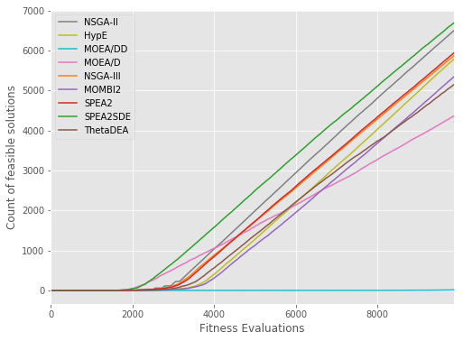
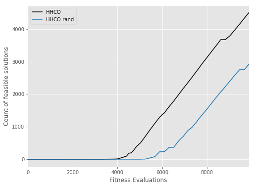
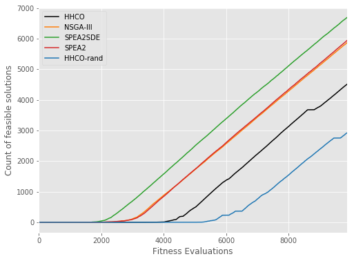
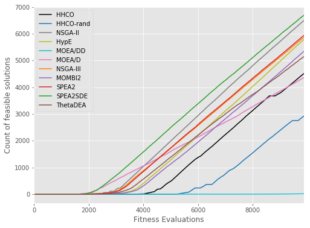

```python
import pandas as pd
import matplotlib.pyplot as plt

import matplotlib
matplotlib.use
import matplotlib.pyplot as plt
plt.style.use('ggplot')

# load data
df = pd.read_csv('WindTurbineDesignRawFeasibleCountMedianRun.csv')
dfmax = df.iloc[[-1]]
dfmaxt = dfmax.transpose()
dfmaxt.columns = ['median']
dfmaxt = dfmaxt.drop('FE', axis=0)

def plot_hypervolume(algs):
    f = plt.figure(figsize=(8, 6))
    ax = f.gca()

    colors={
        "NSGAIII": "tab:orange",
        "SPEA2SDE": "tab:green",
        "SPEA2": "tab:red",
        "CMOMBI2": "tab:purple",
        "ThetaDEA": "tab:brown",
        "CMOEAD": "tab:pink",
        "NSGAII": "tab:grey",
        "HypE": "tab:olive",
        "CMOEADD": "tab:cyan",
        "CHHCO": "k",
        "CHHCORandom": "tab:blue"
    }

    labels={
        "NSGAIII": "NSGA-III",
        "SPEA2SDE": "SPEA2SDE",
        "SPEA2": "SPEA2",
        "CMOMBI2": "MOMBI2",
        "ThetaDEA": "ThetaDEA",
        "CMOEAD": "MOEA/D",
        "NSGAII": "NSGA-II",
        "HypE": "HypE",
        "CMOEADD": "MOEA/DD",
        "CHHCO": "HHCO",
        "CHHCORandom": "HHCO-rand"
    }

    legend=[]
    for alg in algs:
        df.plot(x="FE", y=alg, ax=f.gca(), legend=True, color=colors[alg])
        legend.append(labels[alg])
    plt.xlabel("Fitness Evaluations")
    plt.ylabel("Count of feasible solutions")
    ax.legend(legend);
    plt.show()


```


```python
# MOEAs

plot_hypervolume(["NSGAII","HypE","CMOEADD","CMOEAD","NSGAIII","CMOMBI2","SPEA2","SPEA2SDE","ThetaDEA"])
```





```python
# HHs

plot_hypervolume(["CHHCO", "CHHCORandom"])
```





```python
# best MOEAs and HHs

plot_hypervolume(["CHHCO", "NSGAIII", "SPEA2SDE", "SPEA2", "CHHCORandom"])
```





```python
# all MOEAs and HHs

algs=["CHHCO", "CHHCORandom", "NSGAII","HypE","CMOEADD","CMOEAD","NSGAIII","CMOMBI2","SPEA2","SPEA2SDE","ThetaDEA"]
plot_hypervolume(algs)
```




