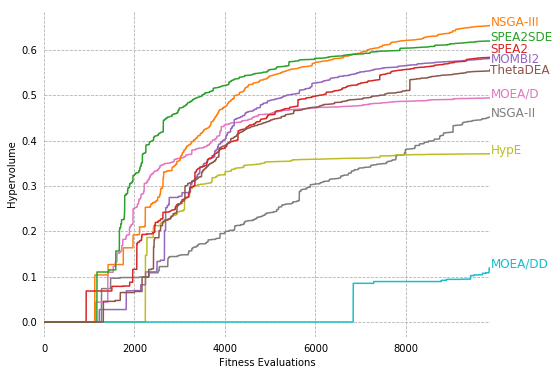
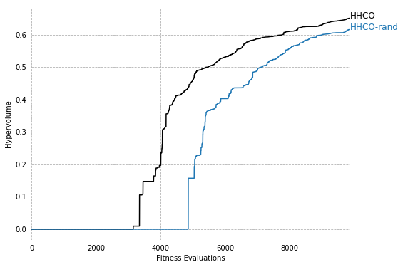
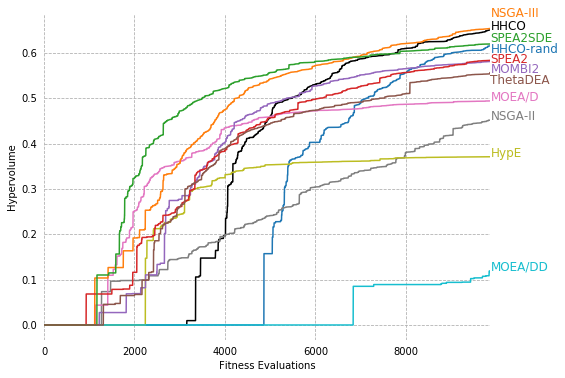

```python
import pandas as pd
import matplotlib.pyplot as plt

# load data
df = pd.read_csv('WindTurbineDesignHypervolumeMedianRun.csv')
dfmax = df.iloc[[-1]]
dfmaxt = dfmax.transpose()
dfmaxt.columns = ['median']
dfmaxt = dfmaxt.drop('FE', axis=0)

dfbest = pd.read_csv('WindTurbineDesignHypervolumeBestRun.csv')
dfmaxbest = dfbest.iloc[[-1]]
dfmaxbest = dfmaxbest.transpose()
dfmaxbest.columns = ['max']
dfmaxbest = dfmaxbest.drop('FE', axis=0)


def plot_hypervolume(algs, offsets):
    f = plt.figure(figsize=(8, 6))
    ax = f.gca()
    ax.spines['top'].set_visible(False)
    ax.spines['bottom'].set_visible(False)
    ax.spines['right'].set_visible(False)
    ax.spines['left'].set_visible(False)

    colors={
        "NSGAIII": "tab:orange",
        "SPEA2SDE": "tab:green",
        "SPEA2": "tab:red",
        "CMOMBI2": "tab:purple",
        "ThetaDEA": "tab:brown",
        "CMOEAD": "tab:pink",
        "NSGAII": "tab:grey",
        "HypE": "tab:olive",
        "CMOEADD": "tab:cyan",
        "CHHCO": "k",
        "CHHCORandom": "tab:blue"
    }

    labels={
        "NSGAIII": "NSGA-III",
        "SPEA2SDE": "SPEA2SDE",
        "SPEA2": "SPEA2",
        "CMOMBI2": "MOMBI2",
        "ThetaDEA": "ThetaDEA",
        "CMOEAD": "MOEA/D",
        "NSGAII": "NSGA-II",
        "HypE": "HypE",
        "CMOEADD": "MOEA/DD",
        "CHHCO": "HHCO",
        "CHHCORandom": "HHCO-rand"
    }

    for alg in algs:
        df.plot(x="FE", y=alg, ax=f.gca(), legend=False, color=colors[alg])
        plt.text(9870, dfmax[alg]+offset[alg], labels[alg], color=colors[alg], fontsize=12)
    plt.xlabel("Fitness Evaluations")
    plt.ylabel("Hypervolume")
    ax.grid(True, ls='--')
    ax.tick_params(axis='both', which='both', # labelsize=14,
               bottom=False, top=False, labelbottom=True,
               left=False, right=False, labelleft=True)
    plt.show()


```


```python
dfmaxbest.index.name = 'alg'
dfmaxbest.reset_index(inplace=True)

dfmaxt.index.name = 'alg'
dfmaxt.reset_index(inplace=True)
```


```python
dfoverall = dfmaxbest.merge(dfmaxt, on = ['alg'], how='inner')

dfoverall.sort_values(by=['median'], inplace=True)

dfoverall = dfoverall.set_index("alg")

dfoverall
```


<div>
<style scoped>
    .dataframe tbody tr th:only-of-type {
        vertical-align: middle;
    }

    .dataframe tbody tr th {
        vertical-align: top;
    }

    .dataframe thead th {
        text-align: right;
    }
</style>
<table border="1" class="dataframe">
  <thead>
    <tr style="text-align: right;">
      <th></th>
      <th>max</th>
      <th>median</th>
    </tr>
    <tr>
      <th>alg</th>
      <th></th>
      <th></th>
    </tr>
  </thead>
  <tbody>
    <tr>
      <td>CMOEADD</td>
      <td>0.314566</td>
      <td>0.119221</td>
    </tr>
    <tr>
      <td>HypE</td>
      <td>0.470731</td>
      <td>0.371032</td>
    </tr>
    <tr>
      <td>NSGAII</td>
      <td>0.451949</td>
      <td>0.451949</td>
    </tr>
    <tr>
      <td>CMOEAD</td>
      <td>0.562005</td>
      <td>0.494201</td>
    </tr>
    <tr>
      <td>ThetaDEA</td>
      <td>0.668918</td>
      <td>0.556663</td>
    </tr>
    <tr>
      <td>CMOMBI2</td>
      <td>0.634919</td>
      <td>0.581138</td>
    </tr>
    <tr>
      <td>SPEA2</td>
      <td>0.664635</td>
      <td>0.583742</td>
    </tr>
    <tr>
      <td>CHHCORandom</td>
      <td>0.661291</td>
      <td>0.615500</td>
    </tr>
    <tr>
      <td>SPEA2SDE</td>
      <td>0.663690</td>
      <td>0.619736</td>
    </tr>
    <tr>
      <td>CHHCO</td>
      <td>0.689392</td>
      <td>0.650861</td>
    </tr>
    <tr>
      <td>NSGAIII</td>
      <td>0.693573</td>
      <td>0.654014</td>
    </tr>
  </tbody>
</table>
</div>


```python
# Hypervolume
ax = dfoverall.plot.bar(y='max', color='tab:orange')
ax = dfoverall.plot.bar(y='median', color='tab:blue', ax=ax)
ax.set_xlabel("")
ax.set_ylabel("Hypervolume")

```


    Text(0,0.5,'Hypervolume')


```python
# MOEAs

offset={
    "NSGAIII": 0.0,
    "SPEA2SDE": 0.0,
    "SPEA2": 0.01,
    "CMOMBI2": -0.01,
    "ThetaDEA": -0.01,
    "CMOEAD": 0.00,
    "NSGAII": 0.00,
    "HypE": 0.00,
    "CMOEADD": 0.00,
}


plot_hypervolume(["NSGAII","HypE","CMOEADD","CMOEAD","NSGAIII","CMOMBI2","SPEA2","SPEA2SDE","ThetaDEA"], offset)
```





```python
# HHs

offset={
    "CHHCO": 0.00,
    "CHHCORandom": 0.00
}

plot_hypervolume(["CHHCO", "CHHCORandom"], offset)
```





```python
# best MOEAs and HHs

offset={
    "NSGAIII": 0.02,
    "SPEA2SDE": 0.005,
    "SPEA2": -0.01,
    "CMOMBI2": 0.0,
    "ThetaDEA": 0.0,
    "CMOEAD": 0.00,
    "NSGAII": 0.00,
    "HypE": 0.00,
    "CMOEADD": 0.00,
    "CHHCO": 0.00,
    "CHHCORandom": -0.015
}


plot_hypervolume(["CHHCO", "NSGAIII", "SPEA2SDE", "SPEA2", "CHHCORandom"], offset)
```


```python
# all MOEAs and HHs

offset={
    "NSGAIII": 0.025,
    "SPEA2SDE": 0.005,
    "SPEA2": -0.005,
    "CMOMBI2": -0.025,
    "ThetaDEA": -0.025,
    "CMOEAD": 0.00,
    "NSGAII": 0.00,
    "HypE": 0.00,
    "CMOEADD": 0.00,
    "CHHCO": 0.00,
    "CHHCORandom": -0.015
}

algs=["CHHCO", "CHHCORandom", "NSGAII","HypE","CMOEADD","CMOEAD","NSGAIII","CMOMBI2","SPEA2","SPEA2SDE","ThetaDEA"]
plot_hypervolume(algs, offset)
```




